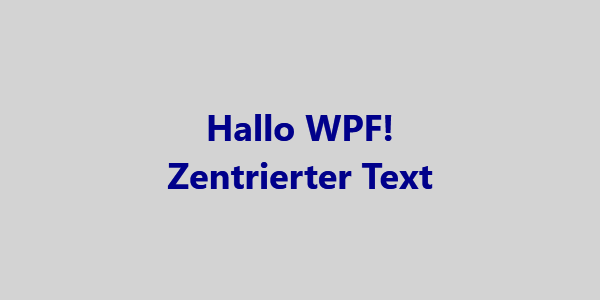

# TextImageWPF


Das Beispiel zeigt, wie ein Bitmap mit einem Custom Text (z.B. png) als Datei oder als Byte-Array erstellt werden kann.

## Erstellen eines Text-Bitmaps (<r>als png Datei</r>), zentriert in einem Rechteck.
```csharp
TextImageRenderer.RectangleTextToFile(@"C:\Temp\Bild_RectangleText.png", 
                                      text: "Hallo WPF!\nZentrierter Text",
                                      width: 600, 
                                      height: 300, 
                                      fontSize: 36, 
                                      fontWeight: FontWeights.Bold, 
                                      textColor: Brushes.DarkBlue, 
                                      backgroundColor: Brushes.LightGray);
```



## Erstellen eines Text-Bitmaps (<r>als png Datei</r>), mit einem Text als Kreis.
```csharp
TextImageRenderer.CircleTextToFile(@"C:\Temp\Bild_CircleText.png", 
                                   text: "123", 
                                   diameter: 160,
                                   circleBrush: Brushes.DarkSlateBlue);
```


# Versionshistorie

- Migration auf NET 10
